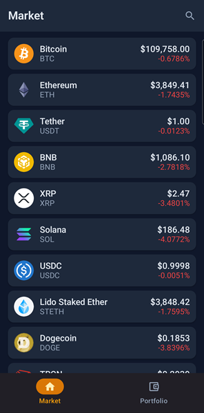
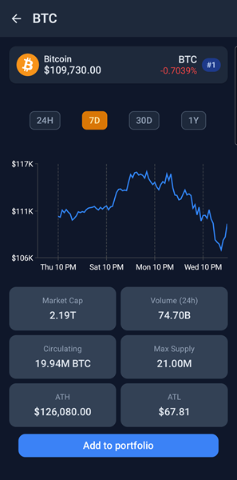
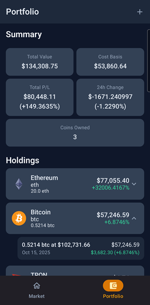
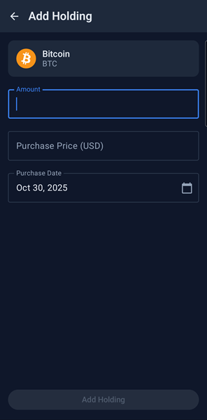
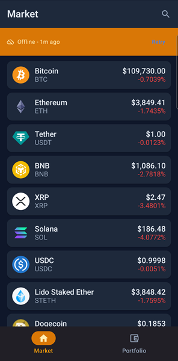

# Hodler - Cryptocurrency Portfolio Tracker

[](https://github.com/luisdelae/hodler-android/actions)

> **hodler** (n.) - Someone who holds cryptocurrency long-term, regardless of market volatility.

Android cryptocurrency portfolio tracker demonstrating Clean Architecture, offline-first data 
synchronization, and modern Android development practices.

## Screenshots








## Features

### Core Functionality
- **Market Overview** - Browse top 100 cryptocurrencies by market cap with live prices
- **Coin Details** - View comprehensive stats and historical price charts (1D, 7D, 1M, 1Y, ALL)
- **Portfolio Tracking** - Manage multiple holdings per coin with purchase price, date, and amount
- **Profit/Loss Calculation** - Real-time portfolio valuation with cost basis and 24h change tracking
- **Offline-First** - Full functionality without network connectivity using cached data
- **Search & Filter** - Find coins by name or symbol with instant filtering

### Technical Highlights
- **Offline-First Architecture** - Network-first with persistent cache fallback
- **Reactive UI** - State management with Kotlin Flow and StateFlow
- **Type-Safe Navigation** - Compile-time safety with Navigation Compose
- **Swipe Actions** - Edit/delete holdings with SwipeableCard gestures
- **Material 3 Design** - Modern UI with dynamic color theming
- **Cache Awareness** - Visual indicators when displaying stale offline data

## Architecture

### Clean Architecture Layers
```
┌────────────────────────────────────────────────────┐
│                  Presentation                      │
│  (ViewModels, Compose UI, Navigation)              │
│  • MarketViewModel, PortfolioViewModel             │
│  • Compose screens with Material 3                 │
│  • Type-safe Navigation Compose                    │
└────────────────────────┬───────────────────────────┘
                         │
┌────────────────────────▼───────────────────────────┐
│                    Domain                          │
│  (Use Cases, Models, Repository Interfaces)        │
│  • ObservePortfolioUseCase                         │
│  • Business logic and domain models                │
│  • Repository contracts                            │
└────────────────────────┬───────────────────────────┘
                         │
┌────────────────────────▼───────────────────────────┐
│                     Data                           │
│  (Repositories, API, Database, Mappers)            │
│  • CoinRepositoryImpl with offline-first caching   │
│  • Retrofit API + Room Database                    │
│  • DTO ↔ Domain model mappers                      │
└────────────────────────────────────────────────────┘
```

### Offline-First Strategy

**Current Implementation (v1.0):**

Network-first with persistent cache fallback:
1. **Attempt API fetch** - Try to get fresh data from CoinGecko
2. **On success** - Cache the data with timestamp and return (`isFromCache = false`)
3. **On failure** - Return cached data if available with banner (`isFromCache = true`)
4. **User refresh** - Pull-to-refresh manually triggers new API call

**Cache behavior:**
- No TTL expiration - cache never expires, always available as fallback
- Update on success - every successful API call refreshes the cache
- Manual refresh - user controls when to fetch latest data
- Full offline mode - app remains functional with cached data

**Benefits:**
- Instant offline access to previously viewed data
- Graceful degradation when network unavailable
- User-controlled refresh (conserves battery/data)
- Clear UX feedback with cache indicator banner

**Future Enhancement (v2.0):**
- 5-minute cache TTL with automatic expiration
- Background sync with WorkManager for periodic updates
- Stale-while-revalidate pattern (instant load + background refresh)
- Smart refresh based on user activity patterns

**Why this approach first?**  
Demonstrates offline-first fundamentals without over-engineering. Background sync adds complexity 
(battery optimization, work constraints, notification channels) better suited for post-MVP iteration. 
Current implementation provides full offline functionality while keeping architecture simple and testable.

### Key Patterns

- **Repository Pattern** - Single source of truth abstracting data sources (API + Database)
- **State Management** - Sealed classes for Loading/Success/Error states with cache metadata
- **Dependency Injection** - Hilt for testability and separation of concerns
- **Flow Operators** - `combine`, `map`, `flatMapLatest` for reactive data streams
- **Use Case Layer** - Encapsulates business logic (e.g., combining holdings with live prices)

## Tech Stack

| Category | Technology |
|----------|-----------|
| **Architecture** | Clean Architecture (3-layer separation) |
| **Language** | Kotlin 2.0 |
| **UI Framework** | Jetpack Compose + Material 3 |
| **Dependency Injection** | Hilt |
| **Async Programming** | Kotlin Coroutines + Flow |
| **Navigation** | Navigation Compose (type-safe routing) |
| **Networking** | Retrofit + OkHttp + Moshi |
| **Local Storage** | Room Database with Flow |
| **Image Loading** | Coil |
| **Charts** | Vico (Compose-native charting) |
| **Testing** | JUnit 4, MockK, Turbine, Coroutines Test |
| **CI/CD** | GitHub Actions with automated builds |

## Getting Started

### Prerequisites
- Android Studio Hedgehog (2023.1.1) or later
- JDK 17
- Android SDK 26+ (target SDK 34)

### Setup

1. **Clone the repository**
```bash
   git https://github.com/luisdelae/hodler-android.git
   cd hodler-android
```

2. **Get a CoinGecko Demo API key**
    - Sign up at [CoinGecko API](https://www.coingecko.com/en/api/pricing)
    - Get a free Demo API key

3. **Add API key to `local.properties`**
```properties
   COINGECKO_API_KEY=your_api_key_here
```

4. **Sync and Build**
```bash
   ./gradlew build
```

5. **Run on device/emulator**
    - Min SDK: 26 (Android 8.0)
    - Target SDK: 34 (Android 14)

### Building Release APK
```bash
# Debug build (no signing required)
./gradlew assembleDebug

# Release build (requires keystore)
./gradlew assembleRelease
```

### Running Tests
```bash
# Unit tests
./gradlew test

# Specific test suite
./gradlew :app:testDebugUnitTest
```

## Testing Strategy

**Coverage Target: 60-70%**

Focused testing on business-critical components:
- ✅ **ViewModels** - Business logic, state transformations, user interactions
- ⏭️ **Repositories** - Cache logic, data mapping, offline fallback behavior
- ⏭️ **Use Cases** - Domain business rules and data aggregation
- ⏭️ **UI Tests** - Deferred for post-launch iteration

**Why not 100%?**  
Time-boxed development (3 weeks) focused on demonstrating architectural patterns over exhaustive coverage.

## Roadmap

### In Development (feature/market-simulator branch)
**Market Simulator** - Paper trading practice environment
- Trade execution with realistic fees and slippage
- Historical data playback for strategy testing
- Portfolio performance analytics with risk metrics
- Leaderboard with risk-adjusted returns (Sharpe ratio)

**Why this feature next?**  
Demonstrates complex state management (trade execution), historical data processing, 
and gamification patterns without requiring real money or KYC compliance.

### Future Considerations
- **Security** - Biometric authentication for portfolio access
- **Widgets** - Home screen portfolio summary with live updates
- **Notifications** - Price alerts and portfolio milestone celebrations
- **Export** - CSV export for tax reporting and analysis
- **Background Sync** - WorkManager periodic price updates (5-min TTL)
- **Localization** - Multi-language support starting with Spanish
- **Advanced Charts** - Technical indicators (MA, RSI, MACD)

## 🤔 Architecture Decisions & Trade-offs

### Why Clean Architecture?
**Pros:** Testable, scalable, framework-independent business logic  
**Cons:** More boilerplate, steeper learning curve, slower initial development  
**Decision:** Worth it for demonstrating senior-level architectural thinking and long-term maintainability

### Why Offline-First? (Future)
**Pros:** Better UX on poor networks, works completely offline, reduced API costs  
**Cons:** Cache invalidation complexity, stale data concerns, increased storage  
**Decision:** Critical for mobile apps - demonstrates production thinking beyond happy-path scenarios

### Why No Background Sync (Yet)?
**Current:** User-triggered refresh only  
**Trade-off:** Simpler architecture, better battery life, no background task complexity  
**Future:** WorkManager periodic sync when app demonstrates user retention  
**Decision:** Ship working offline-first foundation, add auto-sync based on user feedback. 
Demonstrates pragmatic MVP thinking over premature optimization.

### Why Not Compose Multiplatform?
**Focus:** Deep Android expertise over breadth. CMP would dilute demonstration of Android-specific
patterns (Room, Hilt, Navigation). iOS would require separate architecture decisions that muddy the portfolio value.

### Why Single Repository for All Coins?
**Current:** CoinRepositoryImpl handles all coin-related API calls  
**Alternative:** Separate repositories per domain concept  
**Decision:** Coins are single bounded context - splitting would create artificial boundaries 
and duplicate caching logic. If adding wallets/exchanges, those would warrant separate repositories.

### Why Not Paging?
**Current:** Load top 100 coins in single call  
**Trade-off:** Simple implementation, fits in memory (< 1MB), instant search  
**Future:** Would add Paging3 if expanding to thousands of coins  
**Decision:** Top 100 covers 99% of market cap - premature optimization to paginate

### Why Moshi Over Gson?
**Performance:** Moshi uses Kotlin code generation vs Gson reflection  
**Kotlin-first:** Better null safety and default value handling  
**Trade-off:** Slightly larger APK, less widespread adoption  
**Decision:** Modern Android standard, better performance for real-time price updates

## Minimum Viable Product Scope

**What shipped in 3 weeks:**
- ✅ Core portfolio tracking functionality
- ✅ Offline-first architecture foundation
- ✅ Clean Architecture with 3-layer separation
- ✅ 60%+ test coverage on business logic
- ✅ Material 3 UI with proper state handling
- ✅ Production-ready CI/CD pipeline

**What got cut (intentionally):**
- ❌ Exhaustive edge case handling (e.g., rate limiting, retry strategies)
- ❌ UI/instrumentation tests
- ❌ Advanced features (widgets, notifications, biometrics)
- ❌ Animations and micro-interactions
- ❌ Accessibility optimizations (TalkBack, large text)

**Why cut these?**  
Demonstrates ability to prioritize MVP features and ship working software under time constraints. 
These features would be added iteratively based on user feedback and analytics, not upfront assumptions.

## 📄 License

This project is a portfolio demonstration and learning exercise. Not licensed for commercial use.

## 👤 Author

**Luis De La Espriella**  
[GitHub](https://github.com/luisdelae) • [LinkedIn](https://linkedin.com/in/luisdelaespriella)
